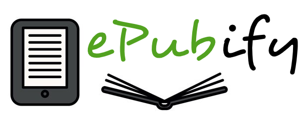
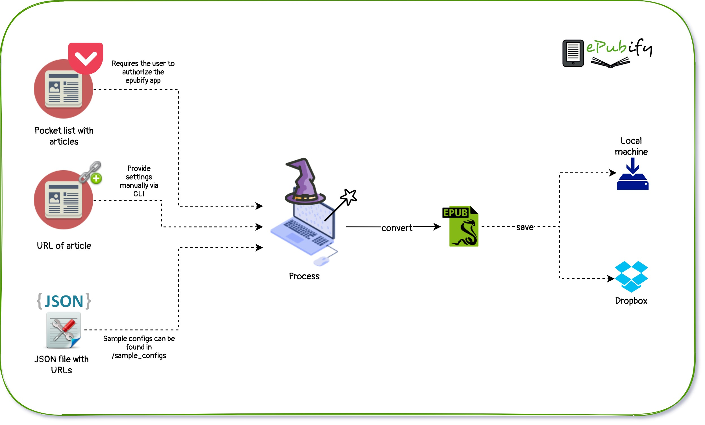

# ePubify

Have you ever wanted to read that huge article, but in a more readable format AND on your EBOOK reader? Maybe you started reading it, but didn't have time to finish? Maybe you use the Pocket application to save your articles? BUT that's not the same like your favourite Kindle or Pocketbook device?! Your eyes hurt?

ePubify is the answer to all that - it's a small application that will fetch the text from your article by having the URL and will store the output epub file directly on your dropbox. If you dropbox contains the folder which your Pocketbook or Kindle syncs from, that means you automatically get that long and interesting article ready for you to sync down on your device and read on your way to work! :) 

Enjoy!

### Architecture
------------



### Installation
------------

```shell
git clone git://github.com/adimitrova/Epubify.git
cd Epubify
pip install -r requirements.txt
```

#### Demo:

<blockquote class="imgur-embed-pub" lang="en" data-id="LbZOrtd"><a href="https://imgur.com/LbZOrtd">View post on imgur.com</a></blockquote><script async src="//s.imgur.com/min/embed.js" charset="utf-8"></script>

--------

## Reading articles

#### Pocket app
Once you run ePubify, it will use epubify's code to request user access code, it will then request the user to authorize the application by automatically opening the browser. Please accept, if you agree to the term. ePubify will request __full access__. But the only thing it actually does, is read your article list, fetch their original URLs and process them. 

To start the application, create your json config file, copy the path to it and run as follows:

```shell
python3 -m Epubify --cf '/path/to/config.json'
```

__NB!__ Sample config available: `sample_configs/pocket_articles_to_dropbox.json`

--------

## Saving ebooks

#### Local machine
You can save to local machine by providing the path to a directory where you want to get your books in the end of the processing. You can pass this in the json config, or via CLI with the `-fp` argument. If this argument is skipped, files will be saved to your Desktop.

If no path is provided, the file will be saved in the project directory, inside the `books` folder.

#### Remotely - to Dropbox
You can save remotely to Dropbox by providing setting the system key to `dropbox` and mode to `remote` in the config file. Read more [here](epubify/sample_configs/)

If no path is provided, the file will be saved in the project directory, inside the `root` of your Dropbox.


## Project Structure

```text
epubify/
├── __init__.py
├── __main__.py
├── ascii_art.py
├── books/
│   └── README.md
├── epubify.py
├── main.py
├── sample_configs/
│   ├── pocket_to_dropbox.json
│   ├── pocket_to_local.json
│   ├── README.md
│   ├── txt_to_local.json
│   ├── urls_to_dropbox.json
│   └── urls_to_local.json
├── systems/
│   ├── __init__.py
│   ├── drop_box.py
│   ├── pocket.py
│   └── vault/
│       ├── __init__.py
│       └── my_keys.json
├── txt_files/
│   ├── cold_war_bulgaria_romania_fixed.txt
│   └── fall_of_the_cabal_fixed.txt
└── utils.py
